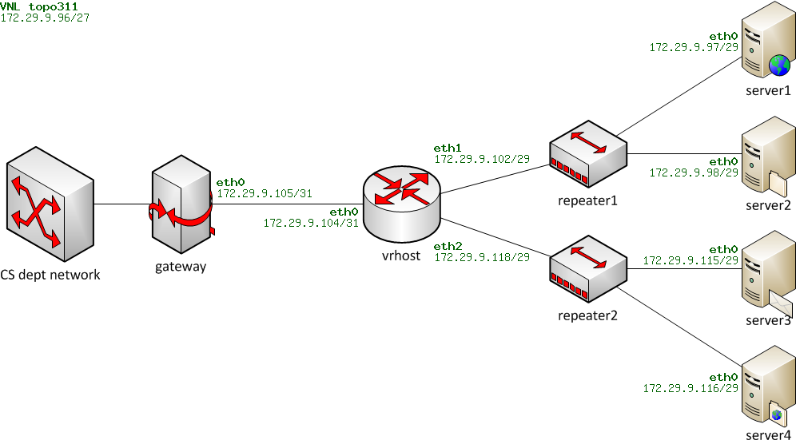
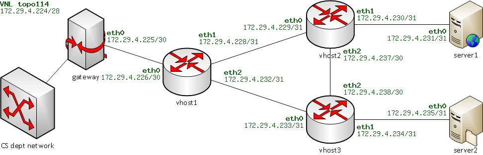

# PWOSPF_protocol

## Overview

This project implements a fully functional **IP router** and a simplified **link-state routing protocol (PWOSPF)** in **C**. It consists of two phases:

1. **Phase 1:** Develop a basic router capable of handling ARP, IP forwarding, and ICMP echo request/reply.

2. **Phase 2:** Extend the router with the PWOSPF protocol for dynamic route computation and topology updates.

Phase 1


Phase 2:




## Features

**Phase 1: Simple Router**

1. **Address Resolution Protocol (ARP):**
    * Handle ARP requests and replies to resolve IP to MAC addresses.
    * Maintain an ARP cache for efficient packet forwarding.

2. **IP Forwarding:**
    * Perform routing table lookups using the longest prefix match.
    * Decrement the TTL field and recalculate the IP checksum for forwarded packets.

3. **ICMP:**
    * Respond to ICMP echo requests with echo replies.

4. **Routing Table:**
    * Load static routing entries from an external file.
    * Forward packets based on the routing table entries.

**Phase 2: PWOSPF Protocol**

1. **HELLO Protocol:**
    * Periodically broadcast HELLO packets to discover and maintain neighbor connections.

2. **Link-State Advertisements (LSAs):**
    * Flood LSAs to distribute connectivity information across the network.

3. **Dynamic Routing:**
    * Build a complete topology database and dynamically compute shortest paths using the Breadth-First Search (BFS) algorithm.

4. **Fault Tolerance:**
    * Detect link failures and recompute routing tables in real-time.
    * Restore routing tables when links recover.


## Usage

**Running the Router**

1. Compile the project:
```
make
```

2. Start the router for your topology:
```
./sr -t <topology_number>
```

## Testing

1. **Phase 1:**
    * Test ARP resolution by pinging server interfaces.
    * Verify IP forwarding and ICMP responses.
    * Use tcpdump or wireshark to inspect packets.

2. **Phase 2:**
    * Run multiple instances of the router for a three-router topology.
    * Test dynamic routing under the following scenarios:
        - Topology convergence after startup.
        - Link failure and recovery.


### Example 1:

To simulate a link failure:
```
vnltopoXX.sh vhost1 setlossy eth1 100
vnltopoXX.sh vhost2 setlossy eth0 100
```

To restore the link:
```
vnltopoXX.sh vhost1 setlossy eth1 0
vnltopoXX.sh vhost2 setlossy eth0 0
```

### Example 2:
Open 4 terminals and ssh to lectura on all 4 of them and then make sure you're inside the correct project directory/folder named 
```
'topXXX', where 'XXX' is topology ID.
```

On terminal 1, run the first router (vhost1) with rtable.net as follows:
```
./sr -t XXX -v vhost1 -r rtable.net
```

On terminal 2, run the second router (vhost2) with rtable.empty as follows:
```
./sr -t XXX -v vhost2 -r rtable.empty
```

On terminal 3, run the third router (vhost3) with rtable.empty as follows:
```
./sr -t XXX -v vhost3 -r rtable.empty
```

On terminal 4, run any ping, wget or link up/down command you want to run.
E.g. in terminal 4 you can do: wget http://ip_of_server2:16280/64MB.bin
or ping ip_of_server1 etc.